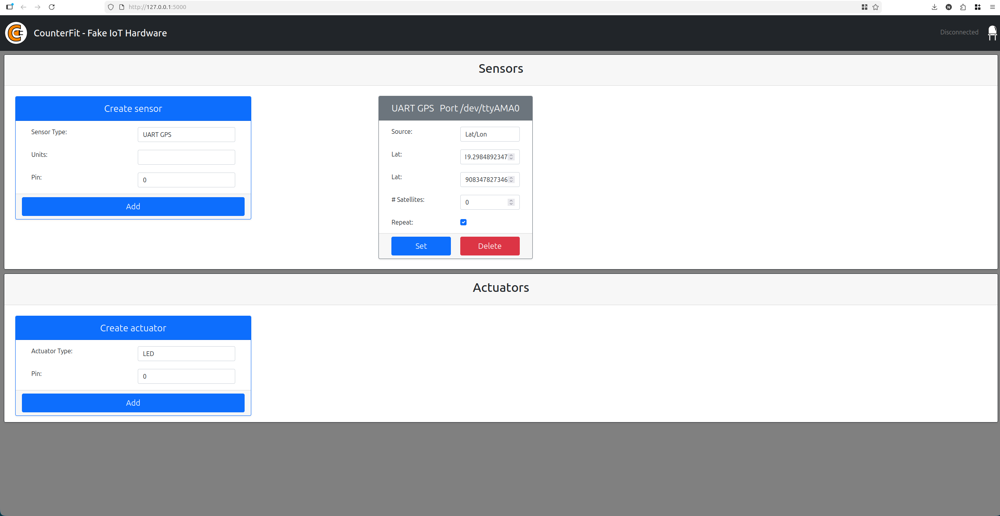
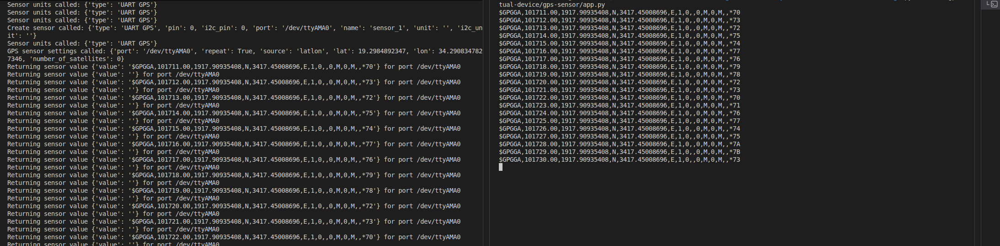
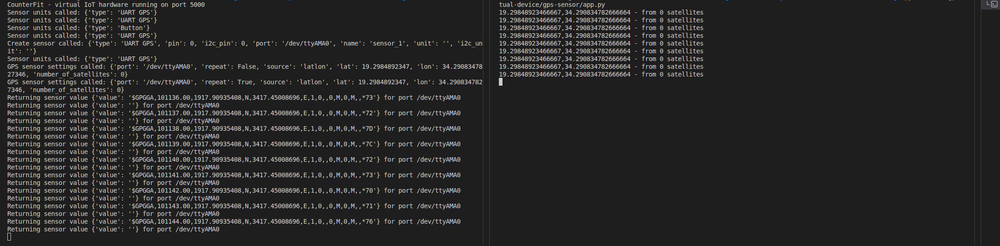
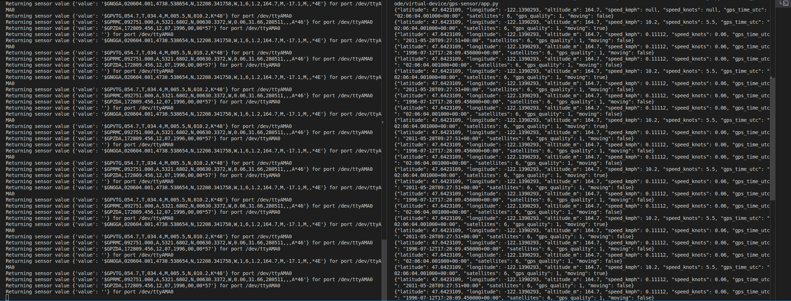

# Proof of Work - Location Tracking

This document records my completed work for the **Location Tracking** lesson using a virtual IoT device with CounterFit. I did not use a real GPS sensor. Instead, I used the simulated **UART GPS** sensor in CounterFit on port `/dev/ttyAMA0`.

## Environment

- Lesson folder: `3-transport/lessons/1-location-tracking`
- Python version: Python 3.11
- Virtual hardware: CounterFit
- GPS input: simulated UART GPS sensor
- Serial port used by the virtual GPS sensor: `/dev/ttyAMA0`
- Dependency manager: `uv`

The dependencies are defined in `pyproject.toml`, including:

- `counterfit`
- `counterfit-shims-serial`
- `pynmea2`
- `werkzeug<3`

## Setup

From this lesson folder, create and sync the virtual environment:

```sh
uv sync
```

Activate the virtual environment:

```sh
source .venv/bin/activate
```

Start CounterFit in one terminal:

```sh
counterfit
```

Then open CounterFit in the browser:

```text
http://127.0.0.1:5000
```

In CounterFit, create the virtual GPS sensor:

1. In **Create sensor**, select **UART GPS**.
2. Set the port to `/dev/ttyAMA0`.
3. Click **Add**.

## Task 1 - Read GPS Sensor Data

For task 1, I used CounterFit to simulate a GPS sensor and read raw NMEA GPS data from the virtual serial port.

Code used:

```text
code-gps/virtual-device/gps-sensor/app.py
```

Run command:

```sh
python code-gps/virtual-device/gps-sensor/app.py
```

Expected result:

The program reads raw NMEA GPS sentences from CounterFit and prints them to the terminal, for example:

```text
$GNGGA,020604.001,4738.538654,N,12208.341758,W,1,3,,164.7,M,-17.1,M,,*67
```

Proof screenshots:





## Task 2 - Decode GPS Sensor Data

For task 2, I decoded the raw NMEA GPS data using the `pynmea2` library. The program extracts useful GPS information such as latitude, longitude, and the number of satellites.

Code used:

```text
code-gps-decode/virtual-device/gps-sensor/app.py
```

Run command:

```sh
python code-gps-decode/virtual-device/gps-sensor/app.py
```

Expected result:

The program parses the NMEA sentences and prints decoded GPS data instead of only raw text. The output includes values such as latitude, longitude, altitude, speed, GPS time, satellites, GPS quality, and movement status.

Example output:

```json
{"latitude": 47.6423109, "longitude": -122.1390293, "altitude_m": 164.7, "speed_kmph": 10.2, "speed_knots": 5.5, "gps_time_utc": "02:06:04.001000+00:00", "satellites": 6, "gps_quality": 1, "moving": true}
```

Proof screenshot:



## Assignment - Investigate Other GPS Data

The assignment asks us to investigate GPS data beyond just location and use that data in the IoT device.

I implemented this in:

```text
code-gps-decode/virtual-device/gps-sensor/app.py
```

The assignment implementation reads and uses additional NMEA data:

- `GGA`: latitude, longitude, altitude, satellites, and GPS quality
- `VTG`: speed over ground in knots and km/h
- `RMC`: GPS date/time and speed
- `ZDA`: GPS date/time

The program stores the latest GPS state and prints it as JSON telemetry. This means the extra GPS data is not only read, but also used by the IoT program as structured telemetry.

The program also uses the speed value to calculate a `moving` field:

```text
moving = true when speed_kmph > 1
```

This satisfies the highest rubric level because the program gets more GPS data and uses it as telemetry.

## Running the Assignment

First, make sure the environment is ready:

```sh
uv sync
source .venv/bin/activate
```

Start CounterFit:

```sh
counterfit
```

Open CounterFit:

```text
http://127.0.0.1:5000
```

Create the virtual GPS sensor if it does not already exist:

1. Select **UART GPS**.
2. Set port to `/dev/ttyAMA0`.
3. Click **Add**.

For the assignment, use NMEA input instead of only Lat/Lon input:

1. Open the UART GPS sensor in CounterFit.
2. Set **Source** to `NMEA`.
3. Paste the contents of this file into the NMEA text box:

```text
code-gps-decode/virtual-device/gps-sensor/assignment-nmea-sample.txt
```

4. Enable **Repeat**.
5. Click **Set**.

Then run the assignment code:

```sh
python code-gps-decode/virtual-device/gps-sensor/app.py
```

Expected assignment output:

```json
{"latitude": 47.6423109, "longitude": -122.1390293, "altitude_m": 164.7, "speed_kmph": 10.2, "speed_knots": 5.5, "gps_time_utc": "02:06:04.001000+00:00", "satellites": 6, "gps_quality": 1, "moving": true}
```

Proof screenshot:




## Completed Work Summary

- Completed task 1 by reading raw NMEA GPS data from a CounterFit virtual GPS sensor.
- Completed task 2 by decoding NMEA GPS data with `pynmea2`.
- Completed the assignment by extracting and using additional GPS data as telemetry.
- Added NMEA sample data for repeatable virtual testing.
- Captured proof screenshots in the `proof-of-work` folder.
